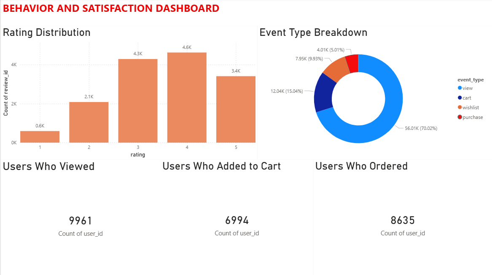
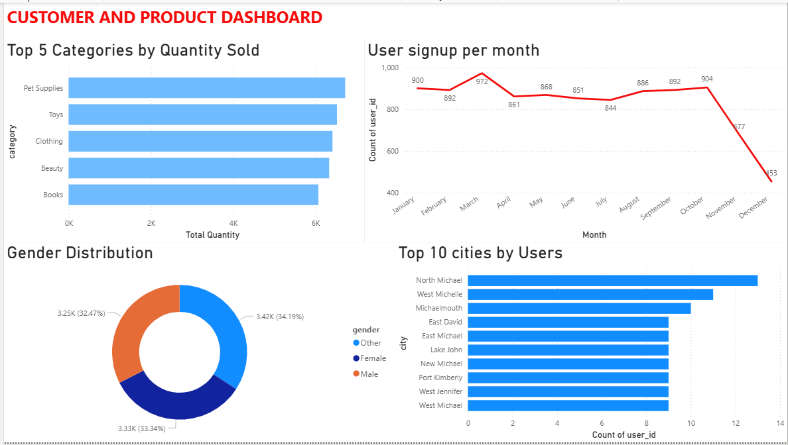
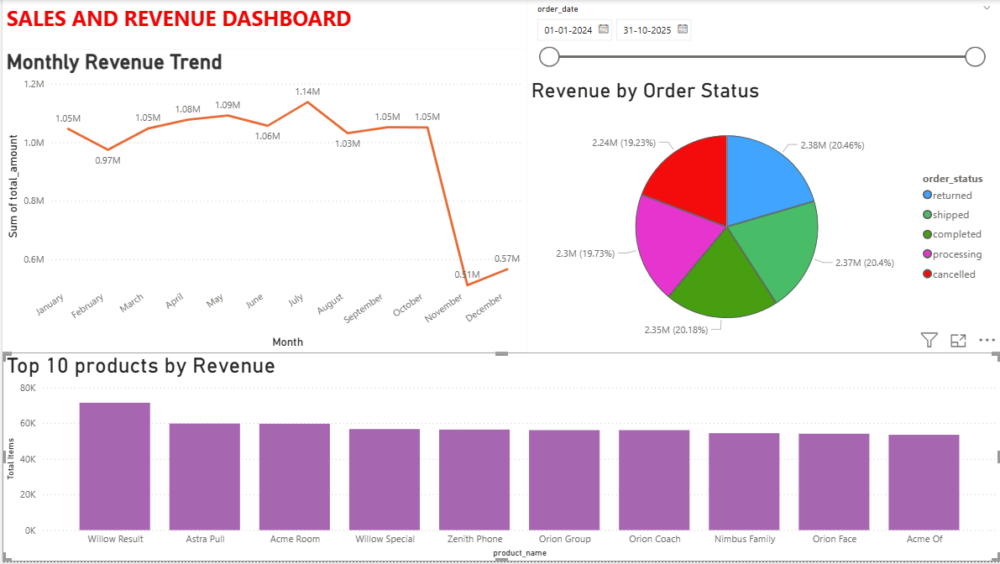

# 🛒 E-Commerce Data Analysis Project


---

## 📌 Overview

This project performs an end-to-end data analysis on a simulated e-commerce dataset.
It covers everything from writing complex SQL queries in MySQL Workbench to building
an interactive 3-page Power BI dashboard with actionable business insights.

---

## 📂 Project Structure

```
ecommerce-sql-powerbi-project/
|
├── sql_project.sql              ← All 24 SQL queries
├── sql_project_powerbi.pbix     ← Power BI Dashboard file
├── README.md                    ← Project documentation
|
└── datasets/
    ├── orders.csv               ← 20,000+ orders
    ├── order_items.csv          ← 43,000+ order items
    ├── products.csv             ← 2,000+ products
    ├── reviews.csv              ← 15,000+ reviews
    ├── users.csv                ← 10,000+ users
    └── events.csv               ← 80,000+ user events
```

---

## 🗄️ Dataset Description

| Table | Records | Key Columns |
|---|---|---|
| orders | 20,000+ | order_id, user_id, order_date, order_status, total_amount |
| order_items | 43,000+ | order_id, product_id, quantity, item_price, item_total |
| products | 2,000+ | product_id, product_name, category, brand, price, rating |
| reviews | 15,000+ | review_id, product_id, user_id, rating, review_date |
| users | 10,000+ | user_id, name, gender, city, signup_date |
| events | 80,000+ | event_id, user_id, product_id, event_type, event_timestamp |

---

## 🔍 SQL Queries (23 Total)

### 📦 Sales & Revenue
| # | Query | Description |
|---|---|---|
| Q1 | Monthly Revenue Trend | Total revenue per month |
| Q2 | Revenue by Order Status | Revenue split by order status |
| Q3 | Top 10 Highest Revenue Orders | Highest value orders |
| Q4 | Average Order Value Per Month | Monthly AOV trend |

### 🛍️ Products & Categories
| # | Query | Description |
|---|---|---|
| Q5 | Top 5 Categories by Quantity | Best selling categories |
| Q6 | Top 10 Products by Revenue | Highest revenue products |
| Q7 | Category-wise Average Rating | Product ratings by category |
| Q8 | Price Distribution by Category | Min, Avg, Max price per category |

### 👥 Users & Demographics
| # | Query | Description |
|---|---|---|
| Q9 | User Signups Per Month | Monthly new user trend |
| Q10 | Gender Distribution | User split by gender |
| Q11 | Top 10 Cities by Users | Cities with most users |
| Q12 | Top 10 Users by Spending | Highest spending customers |

### ⭐ Reviews & Ratings
| # | Query | Description |
|---|---|---|
| Q13 | Rating Distribution | Count of 1★ to 5★ reviews |
| Q14 | Average Rating per Category | Review ratings by category |
| Q15 | Monthly Average Rating Trend | Rating trend over time |
| Q16 | Top 5 Most Reviewed Products | Most reviewed products |

### 🔍 User Behavior
| # | Query | Description |
|---|---|---|
| Q17 | Event Type Breakdown | View, cart, purchase split |
| Q18 | Top 10 Most Viewed Products | Most viewed products |
| Q19 | Events Per Day of Week | Activity by day |

### 🔗 Advanced Queries
| # | Query | Description |
|---|---|---|
| Q20 | Users Who Never Ordered | Inactive user analysis |
| Q21 | Products Never Reviewed | Unreviewed product analysis |
| Q22 | Avg Days to First Order | Time to first purchase metric |
| Q23 | Repeat Customers | Order frequency buckets |

---

## 📊 Power BI Dashboard

### Page 1 — Sales & Revenue Dashboard

- Monthly Revenue Trend (Line Chart)
- Revenue by Order Status (Pie Chart)
- Top 10 Products by Revenue (Bar Chart)
- Date Range Slicer

### Page 2 — Customer & Product Dashboard

- Top 5 Categories by Quantity Sold (Bar Chart)
- User Signups Per Month (Line Chart)
- Gender Distribution (Donut Chart)
- Top 10 Cities by Users (Bar Chart)

### Page 3 — Behavior & Satisfaction Dashboard

- Event Type Breakdown (Donut Chart)
- Rating Distribution (Bar Chart)
- Conversion Rate KPI Cards (Viewed → Carted → Ordered)


---

## 💡 Key Business Insights

- 📈 **Peak Revenue** — Highest revenue observed in **May and June**
- 🛍️ **Top Category** — **Pet Supplies** leads in quantity sold
- 👥 **Gender Split** — Almost equal distribution (Male 32%, Female 33%, Other 34%)
- ⭐ **Customer Satisfaction** — Majority of reviews are **4★ and 5★**
- 🔍 **Conversion Funnel** — **9,961** users viewed → **6,994** carted → **8,635** ordered
- 🏙️ **Top City** — **North Michael** has the highest number of users

---

## 🛠️ Tools Used

| Tool | Purpose |
|---|---|
| MySQL Workbench | Writing and executing SQL queries |
| Power BI Desktop | Building interactive dashboards |
| GitHub | Version control and project hosting |

---

## 👩‍💻 Author

**Shristi Sharma**

[](https://www.linkedin.com/in/shristi-sharma-0a4367370/)
[](https://github.com/ShristiSharma03)

---

⭐ **If you found this project helpful, please give it a star!** ⭐
